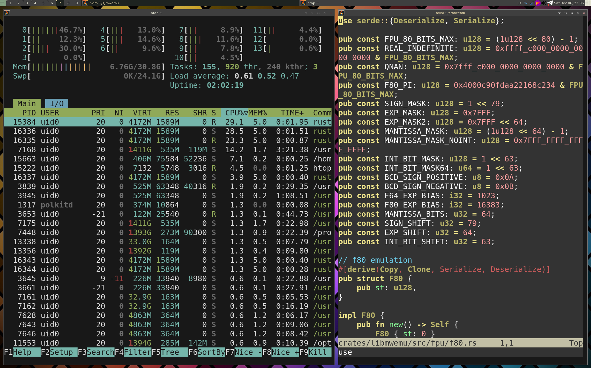

# Sha0's Linux Setup

## Awesome-WM

For me the question is not if using a tiling window manager or not.
The question is which tiling window manager to use?

i3 is a popular very nice and stable option, you don't need to install extra stuff unless dmenu.
I like i3 but I prefer awesome-wm, it's much more confortable to use than i3 and is stable, it exists from many years ago.

awesome-wm is ok by itself but can be powered by extra useful stuff:
- dmenu
- i3lock to lock the screen (or xtrlock if you are freak)
- nm-try for choosing wifi and managing the network a bit
- volctl for controlling audio input and volume (from https://github.com/buzz/volctl) 
- alacritty the best terminal for all archs.

check the awesome-wm configuration to have this awesome desktop.

## NeoVim

The best editor in my opinion, that's difficult to argue is just a feeling, and I was programming since the 90's with all kind of editors. 

There are several plugin systems but use lazy, is quite good.

I use Neovim with no AI but there are plugins for tabnine and other stuff, I reated a plug plugin for ollama to use offline AI, but ... well is not too bad but it's slow to do active scanning, is better to map a key.

I share my nvim setup, specially for coding in rust, but there are better setups on internet.

## Qtile

I liked qtile and prepared a setup, but qtile is not very stable (IMHO) despite it has an awesome and advanced community in discord.

## Telegram

well I did an example with telegram but you an protect any proces in same way limiting resources.
Why giving always all the resoures to all the apps in linux?

## Debian Installers

I prepared scripts that do the apt/pip installation of all the typical tools that I install on every new system.

## Qemu

Doing qemu setups could be painful, so i shared some prepared working setups for several hw emulations.

## Radare2rc

my radare2rc launch some initial commands that are quite convinient to do before starting the analysis.

